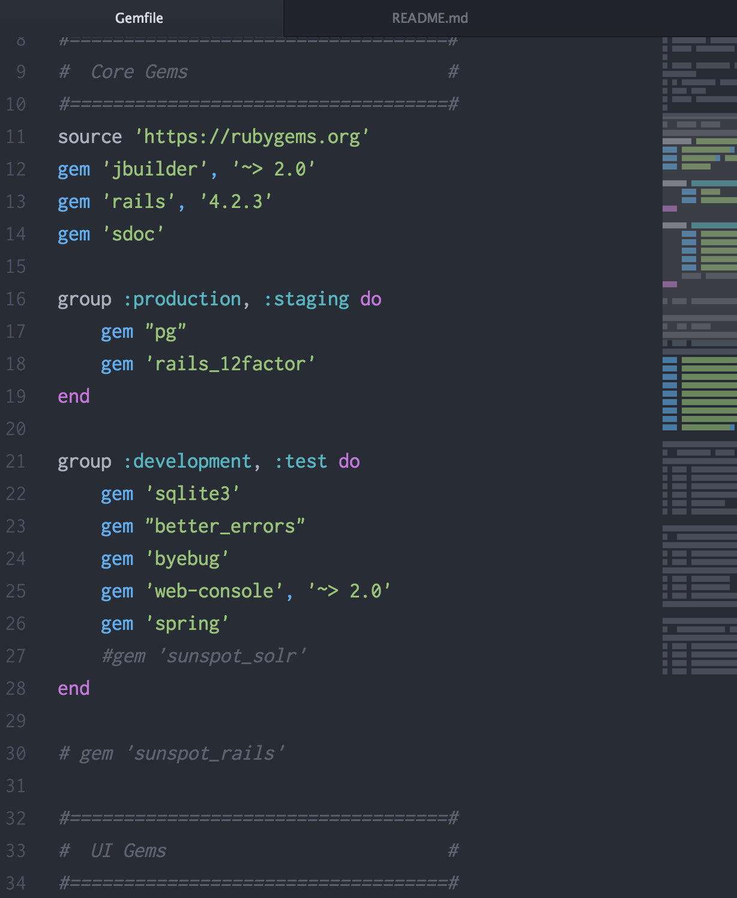

# Super-Gemfile

Super-Gemfile lists the most common gems I use for my Rails projects. There vary from auth gems to search gems and even frontend utility gems like Twitter's Bootstrap. I keep them organized into categories so that they're easy to find when updating or editing them. Yeah, I'll try to keep the gem pointers updated as I go along, but it should be pretty straightforward.

This is just a formatted gemfile that you can pull anytime you want to replace the generated Gemfile that Rails gives you.
